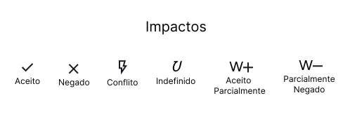
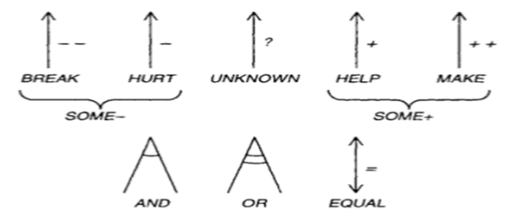

## Histórico de Versão

| Data       | Autor         | Descrição                         | Versão  |
|------------|---------------|-----------------------------------|---------|
| 21/08/2024 |  Danilo Naves do Nascimento  | Criação de documento acerca do NFR | 1.0 |
| 22/08/2024 |  Danilo Naves do Nascimento | Descrição de NFR| 1.1 |
| 22/08/2024 |  Eric Rabelo Borges | Adição do NFR de Segurança e Acessibilidade | 1.2 |
| 22/08/2023 | Danilo Naves do Nascimento | Mapeamento de RNF | 1.3 |

## NFR Framework

O NFR (Non-Functional Requirements) Framework é uma ferramenta útil na engenharia de requisitos para lidar com requisitos não funcionais (como desempenho, segurança, usabilidade, etc.). Ele permite a modelagem desses requisitos como softgoals, que podem ser refinados e relacionados entre si para entender como as decisões impactam o sistema.

## Impactos

> Referências: CHUNG, L., et al. Non-Functional Requirements in Software Engineering. Springer, 2000. CHUNG, L. "Representing and Using Non-Functional Requirements: A Process-Oriented Approach." In: Requirements Engineering Journal, vol. 2, no. 1, 1997, pp. 55-73.

Especificações dos Impactos:

- <strong>Aceito:</strong> Softgoal pode ser cumprido segundo a análise, portanto, escolhido para ser implementado. 

- <strong>Negado:</strong> Softgoal não pode ser cumprido segundo a análise, portanto, não escolhido para ser implementado

- <strong>Conflito:</strong> Existem conflitos de interesse para o cumprimento do softgoal alguns indicadores positivos outros negativos

- <strong>Indefinido:</strong> Realização do softgoal nem pode ser confirmada nem negada.

- <strong>Aceito Parcialmente:</strong> Existem indicadores positivos para o cumprimento do softgoal.

- <strong>Negado Parcialmente:</strong> Existem indicadores contras para o pleno cumprimento do softgoal.

## Contribuições

As contribuições representam as maneiras pelas quais as ações ou características específicas (softgoals de folha) influenciam os requisitos não funcionais mais amplos ou de nível superior (softgoals principais). Essas contribuições podem ser positivas, negativas, ou neutras e são usadas para modelar como diferentes partes do sistema afetam os requisitos gerais.

> Fonte: Requisitos de Software - Slides Aula 17(Pag. 13)

|Contribuições | Símbolo | Descrição |
|--------------|---------|-----------|
|Make|++|FILHO com contribuição tão positiva a ponto de satisfazer o PAI sob a perspectiva dos envolvidos.|
|Help|+| FILHO com contribuição positiva parcial, que sozinho não chega a satisfazer o PAI sob a perspectiva dos envolvidos|
|Unknown|?| FILHO não afeta o PAI|
|Hurt|-|FILHO com contribuição negativa parcial, que sozinho não chega a negar o PAI sob a perspectiva dos envolvidos|
|Break|--| FILHO com contribuição tão negativa a ponto de negar o PAI sob a perspectiva dos envolvidos.|
|Some+|Some +| FILHO com contribuição positiva, cuja intensidade não se pode determinar.|
|Some-|Some -| FILHO com contribuição negativa, cuja intensidade não se pode determinar.|
|And|E| "Pai" é satisfeito se, e somente se, todos os "filhos" forem satisfeitos sob a perspectiva dos envolvidos|
|Or|OU| "Pai" é satisfeito se, e somente se, um dos "filhos" é satisfeito sob a perspectiva dos envolvidos|
|Equal|=| Ambos compartilham o mesmo label.|

> Fonte: Requisitos de Software - Slides Aula 17(Pag. 13)

## NFR - Usabilidade e Confiabilidade {#NFR1}

> Autores: Paulo, Eric, Danilo, Wolf

## NFR - Segurança e Acessibilidade {#NFR2}

> Autores: Eric, Danilo

---

## Especificação NRF {#RNFs}

|  RNF 1 {#RNF1} | Privacidade da Conta do Usuário |
|--------------|--------------|
| Categoria    |  Privacidade|
| Descrição    | O sistema deve permitir que os usuários configurem suas contas para que certas informações ou atividades sejam privadas, controlando quem pode visualizar ou interagir com esses dados.    |
| Justificativa  | Permitir que os usuários configurem suas contas para que certas informações ou atividades sejam privadas é essencial para garantir a segurança e o conforto dos usuários ao utilizarem o sistema.         |
| Conflito       | Nenhum |
| Prioridade     | Alta      |

|  RNF 2 {#RNF2} | Login Fácil com Acessibilidade  |
|--------------|--------------|
| Categoria    | Usuabilidade             |
| Descrição      | O sistema deve permitir que usuários de diferentes habilidades realizem login de forma fácil e acessível              |
| Justificativa  | Optar por um login acessível em vez de um login cheio de etapas de verificação é crucial para garantir a inclusão e a usabilidade para todos os usuários, além de manter fluído a experiência do usuário          |
| Conflito       | Segurança |
| Prioridade     | Alta      |

|  RNF 3  {#RNF3} | Disponibilidade 24/07  |
|--------------|--------------|
| Categoria    |   Confiabilidade           |
| Descrição      | O sistema deve estar disponível para acesso e uso 24 horas por dia, 7 dias por semana, garantindo que os usuários possam utilizá-lo sem interrupções a qualquer momento.              |
| Justificativa  | A disponibilidade 24/7 contribui para uma melhor experiência do cliente, reduzindo a frustração e aumentando a satisfação. Em muitos casos, interrupções no serviço podem levar a perdas significativas, tanto em termos financeiros quanto de reputação        |
| Conflito       | Nenhum |
| Prioridade     | Alta      |

|  RNF 4 {#RNF4} | Atualização constante de informações |
|--------------|--------------|
| Categoria    |   Confiabilidade           |
| Descrição      | O sistema deve garantir que todos os dados exibidos ou processados estejam sempre atualizados, refletindo as informações mais recentes disponíveis em tempo real ou o mais próximo possível disso.              |
| Justificativa  | Garantir que todos os dados exibidos ou processados pelo sistema estejam sempre atualizados é fundamental para a precisão e confiabilidade das informações oferecidas aos usuários.         |
| Conflito       | Nenhum |
| Prioridade     | Alta      |

|  RNF 5 {#RNF5}  | Disponibilidade em Aplicativo e Web |
|--------------|--------------|
| Categoria    |  Suportabilidade          |
| Descrição      | O sistema deve estar disponível e funcional tanto em plataformas de aplicativos móveis (iOS e Android) quanto na web, proporcionando uma experiência consistente e integrada para os usuários em ambas as interfaces.          |
| Justificativa  | Garantir que o sistema esteja disponível e funcional tanto em plataformas de aplicativos móveis (iOS e Android) quanto na web é crucial para oferecer uma experiência de usuário consistente e integrada.          |
| Conflito       | Nenhum  |
| Prioridade     | Alta      |

|  RNF 6 {#RNF6} | Experiência do Usuário |
|--------------|--------------|
| Categoria    |  Usuabilidade         |
| Descrição      | O sistema deve proporcionar uma experiência de usuário intuitiva e agradável, garantindo que os usuários possam navegar, interagir e completar suas tarefas com facilidade e eficiência.          |
| Justificativa  | Proporcionar uma experiência de usuário intuitiva e agradável é fundamental para o sucesso e a aceitação do sistema. Isso contribui para a Satisfação do Usuário, diminuição dos erros e frustrações, etc.    |
| Conflito       |  Nenhum|
| Prioridade     | Alta      |

