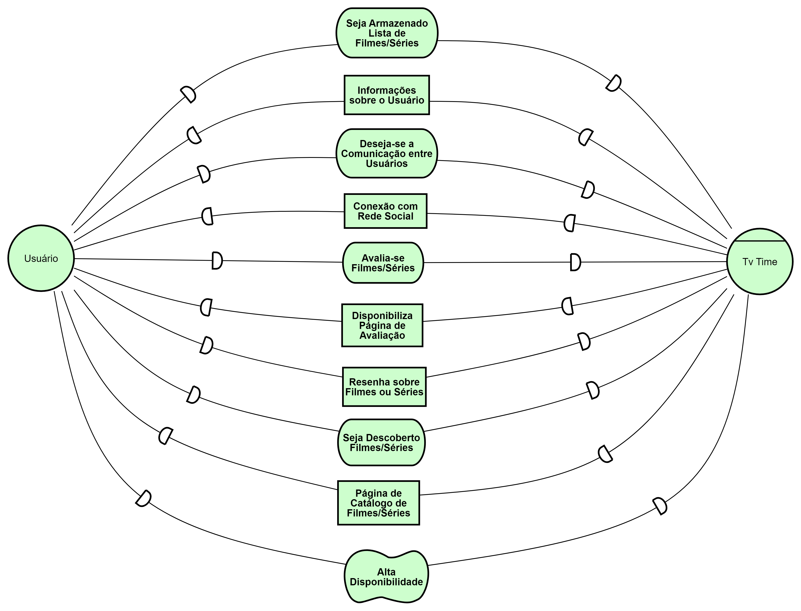
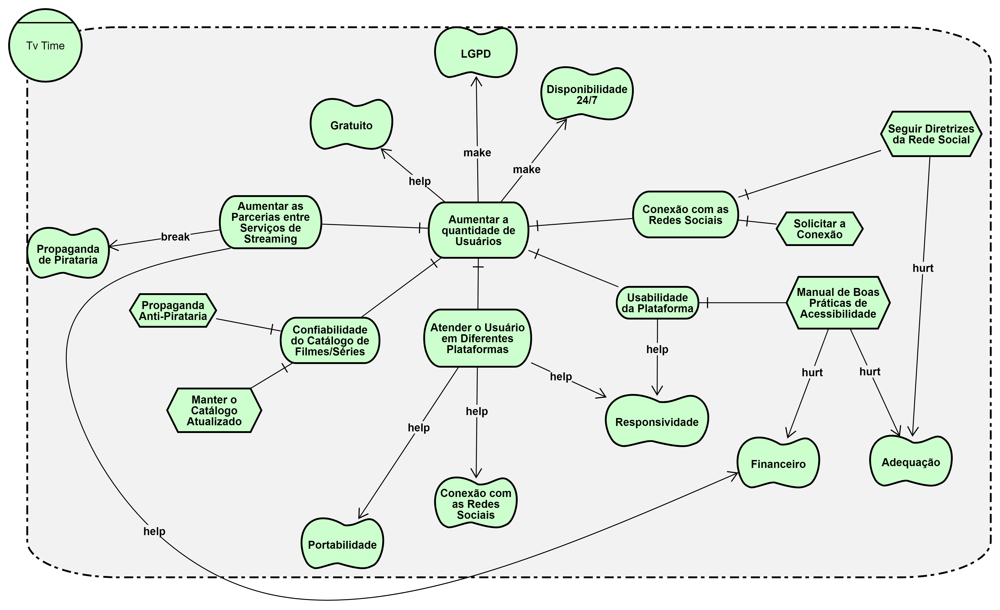
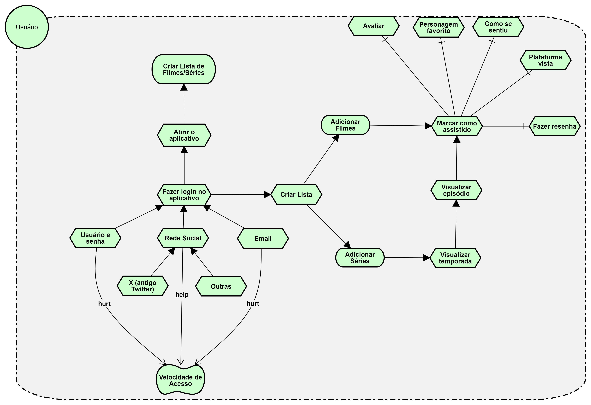
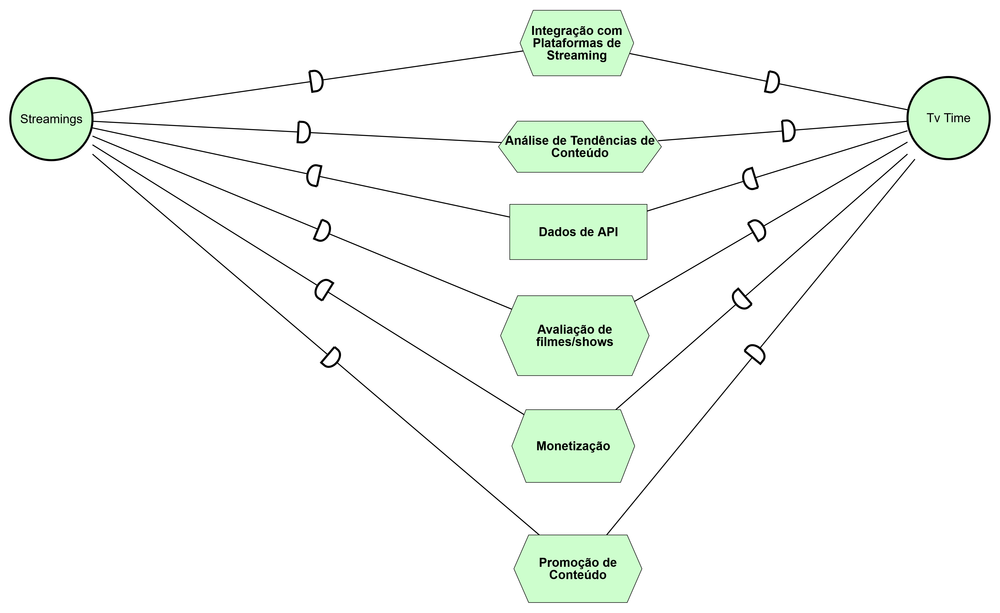
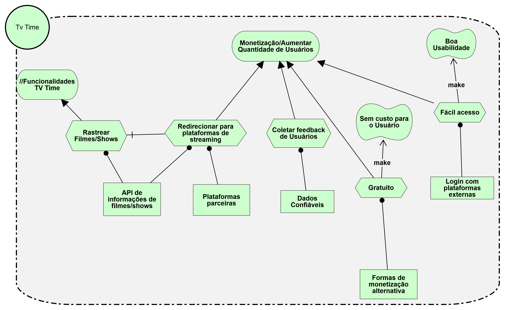
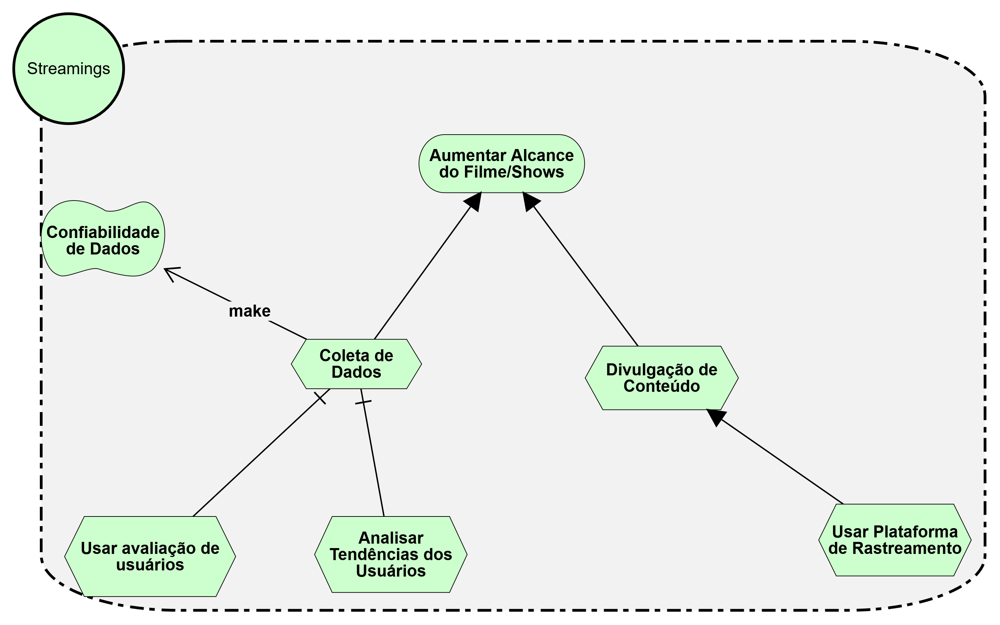

| Data       | Autor         | Descrição                         | Versão  |
|------------|---------------|-----------------------------------|---------|
| 02/09/2024 |  Paulo Henrique Melo de Souza  | Criação de documento sobre o iStar | 1.0 |
| 02/09/2024 |  Wolfgang Friedrich Stein  | Adição dos SD e SR  | 1.1 |
| 03/09/2024 | Danilo Naves do Nascimento | Adição de SD Streaming e SRs | 1.2 |

## Introdução

O iStar é um framwork conceitual que conduz a Engenharia de Requisitos orientada às propriedades intencionais dos envolvidos. Propriedades intencionais são, basicamente, as metas, tarefas, recursos e crenças que os agentes possuem. Sendo uma ferramenta que permite a modelagem dessas propriedades e suas relações, de forma a entender como as decisões impactam o sistema, utilizando-se do SD (Strategic Dependency Model) e SR (Strategic Rationale Model). 

## Metodologia

Como definido na reunião do dia [29/08](../../Atas/reuniao_29_08.md), o grupo se dividiu em duas duplas para iniciar a modelagem do iStar em que definiu-se dois principais módulos: interação do usuário com a aplicação e interação das emissoras com a aplicação.

A primeira dupla, composta por Paulo Henrique e Wolfgang Friedrich, ficou responsável pela modelagem do SD entre o Usuário e a própria aplicação do TV Time, além de montar seus respectivos SR's. A segunda dupla, composta por Eric Rabelo e Danilo Naves, ficou responsável pela modelagem do SD entre a aplicação do Tv Time e as emissoras que enviam seus filmes e séries para a plataforma, além de montar seus respectivos SR's.

Note que ambas as duplas se responsabilizaram pela montagem do SR da aplicação do TV Time, pois dessa forma é possível comparar os dois SR's gerados e buscar entender os diferentes pontos de vista de cada dupla.

# SD da relação usuário TVtime

> Autores: Wolfgang e Paulo. [Referência](../../Atas/reuniao_29_08.md)

# SR do TV time

> Autores: Wolfgang e Paulo. [Referência](../../Atas/reuniao_29_08.md)

# SR do Usuário

> Autores: Wolfgang e Paulo. [Referência](../../Atas/reuniao_29_08.md)

# SD da relação Streamings e TVtime

> Autores: Danilo e Erick. [Referência](../../Atas/reuniao_29_08.md)

# SR TV Time

> Autores: Danilo e Erick. [Referência](../../Atas/reuniao_29_08.md)

# SD Streamings

> Autores: Danilo e Erick. [Referência](../../Atas/reuniao_29_08.md)

