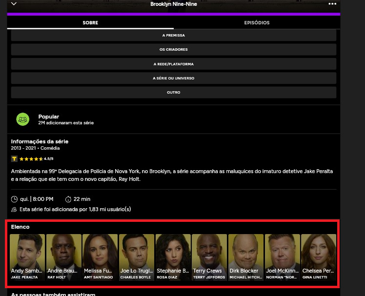

## Histórico de Revisão
---
| Data       | Autor         | Descrição                          | Versão |
|------------|---------------|------------------------------------|--------|
| 08/09/2024 | Paulo Henrique Melo de Souza | Criação do documento Forward-From | 1.0     |
| 08/09/2024 | Paulo Henrique Melo de Souza | Adição dos RF01 ao RF15 | 1.1     |
| 09/09/2024 | Eric Rabelo Borges | Adição dos RF16 ao RF20 | 1.2     |
| 11/09/2024 | Eric Rabelo Borges | Adição dos RF21 ao RF30 | 1.3     |
| 11/09/2024 | Paulo Henrique Melo de Souza | Adicionando introdução e objetivo | 1.4     |
| 11/09/2024 | Danilo Naves Do Nascimento | Adicionando RF31 ao RF45 | 1.5 |
| 11/09/2024 | Wolfgang Friedrich Stein | Adicionando RF 46 ao RF64 | 1.6  |

## Introdução

Semelhante ao [backward-from](backward-from.md), o forward-from é um documento que visa facilitar a navegação entre os requisitos funcionais e as histórias de usuário até sua implementação. rastreia os requisitos funcionais até as técnicas de elicitação e análise que os originaram, o forward-from faz o caminho inverso. Ele parte das histórias de usuário e chega nos requisitos funcionais, mostrando como cada história de usuário é implementada no sistema.

## Objetivo

O objetivo deste documento é fornecer um guia para a navegação entre as histórias de usuário e os requisitos funcionais do sistema, mostrando como cada história de usuário é implementada no sistema. Note que, para facilitar a visualização, cada requisito funcional é apresentado em um detalhamento, com a história de usuário, caso de uso, cenário e funcionalidade associados. Segue abaixo a lista de requisitos funcionais do sistema.

  
 RF01 - 	O sistema deve permitir que o usuário marque episódios como assistidos 

  <table>
    <thead>
      <tr>
        <td>Tema</td>
        <td>Gestão de shows</td>
      </tr>
    </thead>
    <tbody>
      <tr>
        <td>História de usuário</td>
        <td><a href="https://rabelzx.github.io/REQ-FGA-2024-1/Modelagem/Agil/Backlog/#U01">US01</a></td>
      </tr>
      <tr>
        <td>Caso de Uso</td>
        <td><a href="https://rabelzx.github.io/REQ-FGA-2024-1/Modelagem/CasosUsos/espCasosUsos/#UC02">UC02</a></td>
      </tr>
      <tr>
        <td>Cenário</td>
        <td><a href="https://rabelzx.github.io/REQ-FGA-2024-1/Modelagem/Cenarios/cenarios/#cen02">CEN02</a></td>
      </tr>
      <tr>
        <td>Funcionalidade</td>
        <td></td>
      </tr>
    </tbody>
  </table>

  
 RF02 - O sistema deve enviar notificações para o usuário sobre novos episódios de séries que ele segue 

  <table>
    <thead>
      <tr>
        <td>Tema</td>
        <td>Gestão de shows</td>
      </tr>
    </thead>
    <tbody>
      <tr>
        <td>História de usuário</td>
        <td><a href="https://rabelzx.github.io/REQ-FGA-2024-1/Modelagem/Agil/Backlog/#U02">US02</a></td>
      </tr>
      <tr>
        <td>Caso de Uso</td>
        <td>-</td>
      </tr>
      <tr>
        <td>Cenário</td>
        <td><a href="https://rabelzx.github.io/REQ-FGA-2024-1/Modelagem/Cenarios/cenarios/#cen03">CEN03</a></td>
      </tr>
      <tr>
        <td>Funcionalidade</td>
        <td>Inserir imagem de notificação do TV Time</td>
      </tr>
    </tbody>
  </table>

  
 RF03 - O sistema deve permitir que o usuário adicione novas séries à sua lista de favoritos 

  <table>
    <thead>
      <tr>
        <td>Tema</td>
        <td>Gestão de Shows</td>
      </tr>
    </thead>
    <tbody>
      <tr>
        <td>História de usuário</td>
        <td><a href="https://rabelzx.github.io/REQ-FGA-2024-1/Modelagem/Agil/Backlog/#U03">US03</a></td>
      </tr>
      <tr>
        <td>Caso de Uso</td>
        <td><a href="https://rabelzx.github.io/REQ-FGA-2024-1/Modelagem/CasosUsos/espCasosUsos/#UC03">UC03</a></td>
      </tr>
      <tr>
        <td>Cenário</td>
        <td><a href="https://rabelzx.github.io/REQ-FGA-2024-1/Modelagem/Cenarios/cenarios/#cen04">CEN04</a></td>
      </tr>
      <tr>
        <td>Funcionalidade</td>
        <td></td>
      </tr>
    </tbody>
  </table>

  
 RF04 - O sistema deve exibir informações detalhadas sobre cada episódio, incluindo sinopse e elenco 

  <table>
    <thead>
      <tr>
        <td>Tema</td>
        <td>Interação com shows</td>
      </tr>
    </thead>
    <tbody>
      <tr>
        <td>História de usuário</td>
        <td><a href="https://rabelzx.github.io/REQ-FGA-2024-1/Modelagem/Agil/Backlog/#U04">US04</a></td>
      </tr>
      <tr>
        <td>Caso de Uso</td>
        <td><a href="https://rabelzx.github.io/REQ-FGA-2024-1/Modelagem/CasosUsos/espCasosUsos/#UC05">UC05</a></td>
      </tr>
      <tr>
        <td>Cenário</td>
        <td><a href="https://rabelzx.github.io/REQ-FGA-2024-1/Modelagem/Cenarios/cenarios/#cen05">CEN05</a>, <a href="https://rabelzx.github.io/REQ-FGA-2024-1/Modelagem/Cenarios/cenarios/#cen07">CEN07</a></td>
      </tr>
      <tr>
        <td>Funcionalidade</td>
        <td></td>
      </tr>
    </tbody>
  </table>

  
 RF05 - O sistema deve oferecer recomendações de séries com base no histórico de visualização do usuário 

  <table>
    <thead>
      <tr>
        <td>Tema</td>
        <td>Gestão de shows</td>
      </tr>
    </thead>
    <tbody>
      <tr>
        <td>História de usuário</td>
        <td><a href="https://rabelzx.github.io/REQ-FGA-2024-1/Modelagem/Agil/Backlog/#U05">US05</a></td>
      </tr>
      <tr>
        <td>Caso de Uso</td>
        <td>-</td>
      </tr>
      <tr>
        <td>Cenário</td>
        <td>-</td>
      </tr>
      <tr>
        <td>Funcionalidade</td>
        <td></td>>
      </tr>
    </tbody>
  </table>

  
 RF06 - O sistema deve permitir que o usuário dê notas para os episódios assistidos 

  <table>
    <thead>
      <tr>
        <td>Tema</td>
        <td>Interação com shows</td>
      </tr>
    </thead>
    <tbody>
      <tr>
        <td>História de usuário</td>
        <td><a href="https://rabelzx.github.io/REQ-FGA-2024-1/Modelagem/Agil/Backlog/#U06">US06</a></td>
      </tr>
      <tr>
        <td>Caso de Uso</td>
        <td><a href="https://rabelzx.github.io/REQ-FGA-2024-1/Modelagem/CasosUsos/espCasosUsos/#UC05">UC05</a></td>
      </tr>
      <tr>
        <td>Cenário</td>
        <td><a href="https://rabelzx.github.io/REQ-FGA-2024-1/Modelagem/Cenarios/cenarios/#cen05">CEN05</a></td>
      </tr>
      <tr>
        <td>Funcionalidade</td>
        <td></td>
      </tr>
    </tbody>
  </table>

  
 RF07 - O sistema deve permitir que o usuário registre o tipo de dispositivo em que assistiu ao conteúdo 

  <table>
    <thead>
      <tr>
        <td>Tema</td>
        <td>Interação com shows</td>
      </tr>
    </thead>
    <tbody>
      <tr>
        <td>História de usuário</td>
        <td><a href="https://rabelzx.github.io/REQ-FGA-2024-1/Modelagem/Agil/Backlog/#U07">US07</a></td>
      </tr>
      <tr>
        <td>Caso de Uso</td>
        <td><a href="https://rabelzx.github.io/REQ-FGA-2024-1/Modelagem/CasosUsos/espCasosUsos/#UC05">UC05</a></td>
      </tr>
      <tr>
        <td>Cenário</td>
        <td><a href="https://rabelzx.github.io/REQ-FGA-2024-1/Modelagem/Cenarios/cenarios/#cen06">CEN06</a></td>
      </tr>
      <tr>
        <td>Funcionalidade</td>
        <td></td>
      </tr>
    </tbody>
  </table>

  
 RF08 - O sistema deve permitir que o usuário registre suas reações ao assistir ao conteúdo 

  <table>
    <thead>
      <tr>
        <td>Tema</td>
        <td>Interação com shows</td>
      </tr>
    </thead>
    <tbody>
      <tr>
        <td>História de usuário</td>
        <td><a href="https://rabelzx.github.io/REQ-FGA-2024-1/Modelagem/Agil/Backlog/#U08">US08</a></td>
      </tr>
      <tr>
        <td>Caso de Uso</td>
        <td><a href="https://rabelzx.github.io/REQ-FGA-2024-1/Modelagem/CasosUsos/espCasosUsos/#UC05">UC05</a>, <a href="https://rabelzx.github.io/REQ-FGA-2024-1/Modelagem/CasosUsos/espCasosUsos/#UC04">UC04</a></td>
      </tr>
      <tr>
        <td>Cenário</td>
        <td><a href="https://rabelzx.github.io/REQ-FGA-2024-1/Modelagem/Cenarios/cenarios/#cen07">CEN07</a></td>
      </tr>
      <tr>
        <td>Funcionalidade</td>
        <td></td>
      </tr>
    </tbody>
  </table>

  
 RF09 - O sistema deve permitir que o usuário informe em qual plataforma ou serviço de streaming assistiu ao conteúdo 

  <table>
    <thead>
      <tr>
        <td>Tema</td>
        <td>Interação com shows</td>
      </tr>
    </thead>
    <tbody>
      <tr>
        <td>História de usuário</td>
        <td><a href="https://rabelzx.github.io/REQ-FGA-2024-1/Modelagem/Agil/Backlog/#U09">US09</a></td>
      </tr>
      <tr>
        <td>Caso de Uso</td>
        <td>-</td>
      </tr>
      <tr>
        <td>Cenário</td>
        <td>-</td>
      </tr>
      <tr>
        <td>Funcionalidade</td>
        <td></td>
      </tr>
    </tbody>
  </table>

  
 RF10 - O sistema deve permitir que o usuário compartilhe suas atividades em redes sociais 

  <table>
    <thead>
      <tr>
        <td>Tema</td>
        <td>Interações sociais</td>
      </tr>
    </thead>
    <tbody>
      <tr>
        <td>História de usuário</td>
        <td><a href="https://rabelzx.github.io/REQ-FGA-2024-1/Modelagem/Agil/Backlog/#U10">US10</a></td>
      </tr>
      <tr>
        <td>Caso de Uso</td>
        <td>-</a></td>
      </tr>
      <tr>
        <td>Cenário</td>
        <td><a href="https://rabelzx.github.io/REQ-FGA-2024-1/Modelagem/Cenarios/cenarios/#cen09">CEN09</a>, <td><a href="https://rabelzx.github.io/REQ-FGA-2024-1/Modelagem/Cenarios/cenarios/#cen14">CEN14</a></td></td>
      </tr>
      <tr>
        <td>Funcionalidade</td>
        <td></td>
      </tr>
    </tbody>
  </table>

  
 RF11 - O sistema deve permitir que o usuário faça login com redes sociais ou e-mail 

  <table>
    <thead>
      <tr>
        <td>Tema</td>
        <td>Interações sociais</td>
      </tr>
    </thead>
    <tbody>
      <tr>
        <td>História de usuário</td>
        <td><a href="https://rabelzx.github.io/REQ-FGA-2024-1/Modelagem/Agil/Backlog/#U11">US11</a></td>
      </tr>
      <tr>
        <td>Caso de Uso</td>
        <td><a href="https://rabelzx.github.io/REQ-FGA-2024-1/Modelagem/CasosUsos/espCasosUsos/#UC01">UC01</a></td>
      </tr>
      <tr>
        <td>Cenário</td>
        <td><a href="https://rabelzx.github.io/REQ-FGA-2024-1/Modelagem/Cenarios/cenarios/#cen01">CEN01</a></td>
      </tr>
      <tr>
        <td>Funcionalidade</td>
        <td></td>
      </tr>
    </tbody>
  </table>

  
 RF12 - O sistema deve oferecer uma seção para comentários e discussões sobre os episódios 

  <table>
    <thead>
      <tr>
        <td>Tema</td>
        <td>Gestão de shows</td>
      </tr>
    </thead>
    <tbody>
      <tr>
        <td>História de usuário</td>
        <td><a href="https://rabelzx.github.io/REQ-FGA-2024-1/Modelagem/Agil/Backlog/#U12">US12</a></td>
      </tr>
      <tr>
        <td>Caso de Uso</td>
        <td><a href="https://rabelzx.github.io/REQ-FGA-2024-1/Modelagem/CasosUsos/espCasosUsos/#UC05">UC05</a>, <a href="https://rabelzx.github.io/REQ-FGA-2024-1/Modelagem/CasosUsos/espCasosUsos/#UC04">UC04</a></td>
      </tr>
      <tr>
        <td>Cenário</td>
        <td><a href="https://rabelzx.github.io/REQ-FGA-2024-1/Modelagem/Cenarios/cenarios/#cen08">CEN08</a></td>
      </tr>
      <tr>
        <td>Funcionalidade</td>
        <td></td>
      </tr>
    </tbody>
  </table>

  
 RF13 - O sistema deve sincronizar o progresso do usuário entre diferentes dispositivos 

  <table>
    <thead>
      <tr>
        <td>Tema</td>
        <td>Gerência de conta</td>
      </tr>
    </thead>
    <tbody>
      <tr>
        <td>História de usuário</td>
        <td><a href="https://rabelzx.github.io/REQ-FGA-2024-1/Modelagem/Agil/Backlog/#U13">US13</a></td>
      </tr>
      <tr>
        <td>Caso de Uso</td>
        <td>-</td>
      </tr>
      <tr>
        <td>Cenário</td>
        <td>-</td>
      </tr>
    </tbody>
  </table>

  
 RF14 - O usuário deve ser capaz de visualizar seu perfil 

  <table>
    <thead>
      <tr>
        <td>Tema</td>
        <td>Interação de perfil</td>
      </tr>
    </thead>
    <tbody>
      <tr>
        <td>História de usuário</td>
        <td><a href="https://rabelzx.github.io/REQ-FGA-2024-1/Modelagem/Agil/Backlog/#U14">US14</a></td>
      </tr>
      <tr>
        <td>Caso de Uso</td>
        <td>-</td>
      </tr>
      <tr>
        <td>Cenário</td>
        <td><a href="https://rabelzx.github.io/REQ-FGA-2024-1/Modelagem/Cenarios/cenarios/#cen09">CEN09</a></td>
      </tr>
      <tr>
        <td>Funcionalidade</td>
        <td></td>
      </tr>
    </tbody>
  </table>

  
 RF15 - O sistema deve permitir a visualização de quem segue o usuário 

  <table>
    <thead>
      <tr>
        <td>Tema</td>
        <td>Interações sociais</td>
      </tr>
    </thead>
    <tbody>
      <tr>
        <td>História de usuário</td>
        <td><a href="https://rabelzx.github.io/REQ-FGA-2024-1/Modelagem/Agil/Backlog/#U15">US15</a></td>
      </tr>
      <tr>
        <td>Caso de Uso</td>
        <td><a href="https://rabelzx.github.io/REQ-FGA-2024-1/Modelagem/CasosUsos/espCasosUsos/#UC07">UC07</a></td>
      </tr>
      <tr>
        <td>Cenário</td>
        <td><a href="https://rabelzx.github.io/REQ-FGA-2024-1/Modelagem/Cenarios/cenarios/#cen39">CEN39</a></td>
      </tr>
      <tr>
        <td>Funcionalidade</td>
        <td></td>
      </tr>
    </tbody>
  </table>

  
 RF16 - O sistema deve listar todos os comentários do usuário. 

  <table>
    <thead>
      <tr>
        <td>Tema</td>
        <td>Gerência de perfil</td>
      </tr>
    </thead>
    <tbody>
      <tr>
        <td>História de usuário</td>
        <td><a href="https://rabelzx.github.io/REQ-FGA-2024-1/Modelagem/Agil/Backlog/#U16">US16</a></td>
      </tr>
      <tr>
        <td>Caso de Uso</td>
        <td>-</td>
      </tr>
      <tr>
        <td>Cenário</td>
        <td>-</td>
      </tr>
      <tr>
        <td>Funcionalidade</td>
        <td></td>
      </tr>
    </tbody>
  </table>

  
 RF17 - O usuário deve ser capaz de seguir outros usuários. 

  <table>
    <thead>
      <tr>
        <td>Tema</td>
        <td>Interações sociais</td>
      </tr>
    </thead>
    <tbody>
      <tr>
        <td>História de usuário</td>
        <td><a href="https://rabelzx.github.io/REQ-FGA-2024-1/Modelagem/Agil/Backlog/#U17">US17</a></td>
      </tr>
      <tr>
        <td>Caso de Uso</td>
        <td>-</td>
      </tr>
      <tr>
        <td>Cenário</td>
        <td>-</td>
      </tr>
      <tr>
        <td>Funcionalidade</td>
        <td></td>
      </tr>
    </tbody>
  </table>

  
 RF18 - O sistema deve permitir a filtragem baseada na ordem de relevância dos comentários do usuário. 

  <table>
    <thead>
      <tr>
        <td>Tema</td>
        <td>Interação com shows</td>
      </tr>
    </thead>
    <tbody>
      <tr>
        <td>História de usuário</td>
        <td><a href="https://rabelzx.github.io/REQ-FGA-2024-1/Modelagem/Agil/Backlog/#U18">US18</a></td>
      </tr>
      <tr>
        <td>Caso de Uso</td>
        <td>-</td>
      </tr>
      <tr>
        <td>Cenário</td>
        <td>-</td>
      </tr>
      <tr>
        <td>Funcionalidade</td>
        <td></td>
      </tr>
    </tbody>
  </table>

  
 RF19 - O usuário poderá excluir um comentário. 

  <table>
    <thead>
      <tr>
        <td>Tema</td>
        <td>Interação com shows</td>
      </tr>
    </thead>
    <tbody>
      <tr>
        <td>História de usuário</td>
        <td><a href="https://rabelzx.github.io/REQ-FGA-2024-1/Modelagem/Agil/Backlog/#U19">US19</a></td>
      </tr>
      <tr>
        <td>Caso de Uso</td>
        <td>-</td>
      </tr>
      <tr>
        <td>Cenário</td>
        <td>-</td>
      </tr>
      <tr>
        <td>Funcionalidade</td>
        <td></td>
      </tr>
    </tbody>
  </table>

  
 RF20 - O sistema deve permitir o compartilhamento de comentários para redes sociais vizinhas. 

  <table>
    <thead>
      <tr>
        <td>Tema</td>
        <td>Interação com shows</td>
      </tr>
    </thead>
    <tbody>
      <tr>
        <td>História de usuário</td>
        <td><a href="https://rabelzx.github.io/REQ-FGA-2024-1/Modelagem/Agil/Backlog/#U20">US20</a></td>
      </tr>
      <tr>
        <td>Caso de Uso</td>
        <td>-</td>
      </tr>
      <tr>
        <td>Cenário</td>
        <td>-</td>
      </tr>
      <tr>
        <td>Funcionalidade</td>
        <td></td>
      </tr>
    </tbody>
  </table>

  
 RF21 - O sistema deve permitir que o usuário acesse um único comentário em específico. 

  <table>
    <thead>
      <tr>
        <td>Tema</td>
        <td>Gerência de perfil</td>
      </tr>
    </thead>
    <tbody>
      <tr>
        <td>História de usuário</td>
        <td><a href="https://rabelzx.github.io/REQ-FGA-2024-1/Modelagem/Agil/Backlog/#U21">US21</a></td>
      </tr>
      <tr>
        <td>Caso de Uso</td>
        <td>-</td>
      </tr>
      <tr>
        <td>Cenário</td>
        <td>-</td>
      </tr>
      <tr>
        <td>Funcionalidade</td>
        <td></td>
      </tr>
    </tbody>
  </table>

  
 RF22 - O usuário deve ser capaz de adicionar uma foto de perfil. 

  <table>
    <thead>
      <tr>
        <td>Tema</td>
        <td>Gerência de perfil</td>
      </tr>
    </thead>
    <tbody>
      <tr>
        <td>História de usuário</td>
        <td><a href="https://rabelzx.github.io/REQ-FGA-2024-1/Modelagem/Agil/Backlog/#U22">US22</a></td>
      </tr>
      <tr>
        <td>Caso de Uso</td>
        <td><a href="https://rabelzx.github.io/REQ-FGA-2024-1/Modelagem/CasosUsos/espCasosUsos/#UC06">UC06</a></td>
      </tr>
      <tr>
        <td>Cenário</td>
        <td><a href="https://rabelzx.github.io/REQ-FGA-2024-1/Modelagem/Cenarios/cenarios/#cen10">CEN10</a></td>
      </tr>
      <tr>
        <td>Funcionalidade</td>
        <td></td>
      </tr>
    </tbody>
  </table>

  
 RF23 - O usuário deve ser capaz de adicionar uma foto de capa ao perfil. 

  <table>
    <thead>
      <tr>
        <td>Tema</td>
        <td>Gerência de perfil</td>
      </tr>
    </thead>
    <tbody>
      <tr>
        <td>História de usuário</td>
        <td><a href="https://rabelzx.github.io/REQ-FGA-2024-1/Modelagem/Agil/Backlog/#U23">US23</a></td>
      </tr>
      <tr>
        <td>Caso de Uso</td>
        <td><a href="https://rabelzx.github.io/REQ-FGA-2024-1/Modelagem/CasosUsos/espCasosUsos/#UC06">UC06</a></td>
      </tr>
      <tr>
        <td>Cenário</td>
        <td><a href="https://rabelzx.github.io/REQ-FGA-2024-1/Modelagem/Cenarios/cenarios/#cen10">CEN10</a></td>
      </tr>
      <tr>
        <td>Funcionalidade</td>
        <td></td>
      </tr>
    </tbody>
  </table>

  
 RF24 - O usuário poderá trocar seu nome de exibição para outros usuários. 

  <table>
    <thead>
      <tr>
        <td>Tema</td>
        <td>Gerência de perfil</td>
      </tr>
    </thead>
    <tbody>
      <tr>
        <td>História de usuário</td>
        <td><a href="https://rabelzx.github.io/REQ-FGA-2024-1/Modelagem/Agil/Backlog/#U24">US24</a></td>
      </tr>
      <tr>
        <td>Caso de Uso</td>
        <td><a href="https://rabelzx.github.io/REQ-FGA-2024-1/Modelagem/CasosUsos/espCasosUsos/#UC06">UC06</a></td>
      </tr>
      <tr>
        <td>Cenário</td>
        <td>-</td>
      </tr>
      <tr>
        <td>Funcionalidade</td>
        <td></td>
      </tr>
    </tbody>
  </table>

  
 RF25 - O usuário deve ser capaz de editar suas informações pessoais. 

  <table>
    <thead>
      <tr>
        <td>Tema</td>
        <td>Gerência de perfil</td>
      </tr>
    </thead>
    <tbody>
      <tr>
        <td>História de usuário</td>
        <td><a href="https://rabelzx.github.io/REQ-FGA-2024-1/Modelagem/Agil/Backlog/#U25">US25</a></td>
      </tr>
      <tr>
        <td>Caso de Uso</td>
        <td><a href="https://rabelzx.github.io/REQ-FGA-2024-1/Modelagem/CasosUsos/espCasosUsos/#UC06">UC06</a></td>
      </tr>
      <tr>
        <td>Cenário</td>
        <td>-</td>
      </tr>
      <tr>
        <td>Funcionalidade</td>
        <td></td>
      </tr>
    </tbody>
  </table>

  
 RF26 - O sistema deve computar o tempo gasto do usuário assistindo filmes ou séries. 

  <table>
    <thead>
      <tr>
        <td>Tema</td>
        <td>Interação de perfil</td>
      </tr>
    </thead>
    <tbody>
      <tr>
        <td>História de usuário</td>
        <td><a href="https://rabelzx.github.io/REQ-FGA-2024-1/Modelagem/Agil/Backlog/#U26">US26</a></td>
      </tr>
      <tr>
        <td>Caso de Uso</td>
        <td>-</td>
      </tr>
      <tr>
        <td>Cenário</td>
        <td><a href="https://rabelzx.github.io/REQ-FGA-2024-1/Modelagem/Cenarios/cenarios/#cen27">CEN27</a></td>
      </tr>
      <tr>
        <td>Funcionalidade</td>
        <td></td>
      </tr>
    </tbody>
  </table>

  
 RF27 - O sistema deve computar a quantidade de episódios vistos pelo usuário. 

  <table>
    <thead>
      <tr>
        <td>Tema</td>
        <td>Interação de perfil</td>
      </tr>
    </thead>
    <tbody>
      <tr>
        <td>História de usuário</td>
        <td><a href="https://rabelzx.github.io/REQ-FGA-2024-1/Modelagem/Agil/Backlog/#U27">US27</a></td>
      </tr>
      <tr>
        <td>Caso de Uso</td>
        <td>-</td>
      </tr>
      <tr>
        <td>Cenário</td>
        <td><a href="https://rabelzx.github.io/REQ-FGA-2024-1/Modelagem/Cenarios/cenarios/#cen27">CEN27</a></td>
      </tr>
      <tr>
        <td>Funcionalidade</td>
        <td></td>
      </tr>
    </tbody>
  </table>

  
 RF28 - O sistema deve computar a quantidade de filmes vistos pelo usuário. 

  <table>
    <thead>
      <tr>
        <td>Tema</td>
        <td>Interação de perfil</td>
      </tr>
    </thead>
    <tbody>
      <tr>
        <td>História de usuário</td>
        <td><a href="https://rabelzx.github.io/REQ-FGA-2024-1/Modelagem/Agil/Backlog/#U28">US28</a></td>
      </tr>
      <tr>
        <td>Caso de Uso</td>
        <td>-</td>
      </tr>
      <tr>
        <td>Cenário</td>
        <td><a href="https://rabelzx.github.io/REQ-FGA-2024-1/Modelagem/Cenarios/cenarios/#cen27">CEN27</a></td>
      </tr>
      <tr>
        <td>Funcionalidade</td>
        <td></td>
      </tr>
    </tbody>
  </table>

  
 RF29 - O usuário deve ser capaz de criar novas listas. 

  <table>
    <thead>
      <tr>
        <td>Tema</td>
        <td>Personalização de listas</td>
      </tr>
    </thead>
    <tbody>
      <tr>
        <td>História de usuário</td>
        <td><a href="https://rabelzx.github.io/REQ-FGA-2024-1/Modelagem/Agil/Backlog/#U29">US29</a></td>
      </tr>
      <tr>
        <td>Caso de Uso</td>
        <td>-</td>
      </tr>
      <tr>
        <td>Cenário</td>
        <td><a href="https://rabelzx.github.io/REQ-FGA-2024-1/Modelagem/Cenarios/cenarios/#cen11">CEN11</a></td>
      </tr>
      <tr>
        <td>Funcionalidade</td>
        <td></td>
      </tr>
    </tbody>
  </table>

  
 RF30 - O usuário deve conseguir adicionar um nome e descrição à nova lista. 

  <table>
    <thead>
      <tr>
        <td>Tema</td>
        <td>Personalização de listas</td>
      </tr>
    </thead>
    <tbody>
      <tr>
        <td>História de usuário</td>
        <td><a href="https://rabelzx.github.io/REQ-FGA-2024-1/Modelagem/Agil/Backlog/#U30">US30</a></td>
      </tr>
      <tr>
        <td>Caso de Uso</td>
        <td>-</td>
      </tr>
      <tr>
        <td>Cenário</td>
        <td><a href="https://rabelzx.github.io/REQ-FGA-2024-1/Modelagem/Cenarios/cenarios/#cen12">CEN12</a></td>
      </tr>
      <tr>
        <td>Funcionalidade</td>
        <td></td>
      </tr>
    </tbody>
  </table>

  
 RF31 - O sistema deve permitir que o usuário deixe a lista oculta para outros usuários. 

  <table>
    <thead>
      <tr>
        <td>Tema</td>
        <td>Personalização de listas</td>
      </tr>
    </thead>
    <tbody>
      <tr>
        <td>História de usuário</td>
        <td><a href="https://rabelzx.github.io/REQ-FGA-2024-1/Modelagem/Agil/Backlog/#US31">US31</a></td>
      </tr>
      <tr>
        <td>Caso de Uso</td>
        <td>-</td>
      </tr>
      <tr>
        <td>Cenário</td>
        <td><a href="https://rabelzx.github.io/REQ-FGA-2024-1/Modelagem/Cenarios/cenarios/#cen19">CEN19</a></td>
      </tr>
      <tr>
        <td>Funcionalidade</td>
        <td></td>
      </tr>
    </tbody>
  </table>

  
 RF32 - O sistema deve permitir que o usuário adicione filmes ou séries à lista existente. 

  <table>
    <thead>
      <tr>
        <td>Tema</td>
        <td>Personalização de listas</td>
      </tr>
    </thead>
    <tbody>
      <tr>
        <td>História de usuário</td>
        <td><a href="https://rabelzx.github.io/REQ-FGA-2024-1/Modelagem/Agil/Backlog/#US32">US32</a></td>
      </tr>
      <tr>
        <td>Caso de Uso</td>
        <td>-</td>
      </tr>
      <tr>
        <td>Cenário</td>
        <td><a href="https://rabelzx.github.io/REQ-FGA-2024-1/Modelagem/Cenarios/cenarios/#cen12">CEN12</a></td>
      </tr>
      <tr>
        <td>Funcionalidade</td>
        <td></td>
      </tr>
    </tbody>
  </table>

  
 RF33 - O sistema deve permitir que o usuário acesse suas listas existentes. 

  <table>
    <thead>
      <tr>
        <td>Tema</td>
        <td>Personalização de listas</td>
      </tr>
    </thead>
    <tbody>
      <tr>
        <td>História de usuário</td>
        <td><a href="https://rabelzx.github.io/REQ-FGA-2024-1/Modelagem/Agil/Backlog/#US33">US33</a></td>
      </tr>
      <tr>
        <td>Caso de Uso</td>
        <td>-</td>
      </tr>
      <tr>
        <td>Cenário</td>
        <td>-</td>
      </tr>
      <tr>
        <td>Funcionalidade</td>
        <td></td>
      </tr>
    </tbody>
  </table>

  
 RF34 - O sistema deve permitir que o usuário atualize uma lista existente. 

  <table>
    <thead>
      <tr>
        <td>Tema</td>
        <td>Personalização de listas</td>
      </tr>
    </thead>
    <tbody>
      <tr>
        <td>História de usuário</td>
        <td><a href="https://rabelzx.github.io/REQ-FGA-2024-1/Modelagem/Agil/Backlog/#US34">US34</a></td>
      </tr>
      <tr>
        <td>Caso de Uso</td>
        <td>-</td>
      </tr>
      <tr>
        <td>Cenário</td>
        <td><a href="https://rabelzx.github.io/REQ-FGA-2024-1/Modelagem/Cenarios/cenarios/#cen12">CEN12</a></td>
      </tr>
      <tr>
        <td>Funcionalidade</td>
        <td></td>
      </tr>
    </tbody>
  </table>

  
 RF35 - O sistema deve permitir que o usuário exclua uma lista. 

  <table>
    <thead>
      <tr>
        <td>Tema</td>
        <td>Personalização de listas</td>
      </tr>
    </thead>
    <tbody>
      <tr>
        <td>História de usuário</td>
        <td><a href="https://rabelzx.github.io/REQ-FGA-2024-1/Modelagem/Agil/Backlog/#U35">US35</a></td>
      </tr>
      <tr>
        <td>Caso de Uso</td>
        <td>-</td>
      </tr>
      <tr>
        <td>Cenário</td>
        <td><a href="https://rabelzx.github.io/REQ-FGA-2024-1/Modelagem/Cenarios/cenarios/#cen13">CEN13</a></td>
      </tr>
      <tr>
        <td>Funcionalidade</td>
        <td></td>
      </tr>
    </tbody>
  </table>

  
 RF36 - O usuário deve ser capaz de acessar suas séries/filmes selecionadas. 

  <table>
    <thead>
      <tr>
        <td>Tema</td>
        <td>Gestão de shows</td>
      </tr>
    </thead>
    <tbody>
      <tr>
        <td>História de usuário</td>
        <td><a href="https://rabelzx.github.io/REQ-FGA-2024-1/Modelagem/Agil/Backlog/#U36">US36</a></td>
      </tr>
      <tr>
        <td>Caso de Uso</td>
        <td>-</td>
      </tr>
      <tr>
        <td>Cenário</td>
        <td><a href="https://rabelzx.github.io/REQ-FGA-2024-1/Modelagem/Cenarios/cenarios/#cen16">CEN16</a></td>
      </tr>
      <tr>
        <td>Funcionalidade</td>
        <td></td>
      </tr>
    </tbody>
  </table>

  
 RF37 - O sistema deve permitir que o usuário separe entre séries/filmes vistas e não vistas. 

  <table>
    <thead>
      <tr>
        <td>Tema</td>
        <td>Gestão de shows</td>
      </tr>
    </thead>
    <tbody>
      <tr>
        <td>História de usuário</td>
        <td><a href="https://rabelzx.github.io/REQ-FGA-2024-1/Modelagem/Agil/Backlog/#U37">US37</a></td>
      </tr>
      <tr>
        <td>Caso de Uso</td>
        <td>-</td>
      </tr>
      <tr>
        <td>Cenário</td>
        <td><a href="https://rabelzx.github.io/REQ-FGA-2024-1/Modelagem/Cenarios/cenarios/#cen15">CEN15</a></td>
      </tr>
      <tr>
        <td>Funcionalidade</td>
        <td></td>
      </tr>
    </tbody>
  </table>

  
 RF38 - O usuário deve ser capaz de localizar filmes/séries por meio de um filtro. 

  <table>
    <thead>
      <tr>
        <td>Tema</td>
        <td>Gestão de shows</td>
      </tr>
    </thead>
    <tbody>
      <tr>
        <td>História de usuário</td>
        <td><a href="https://rabelzx.github.io/REQ-FGA-2024-1/Modelagem/Agil/Backlog/#U38">US38</a></td>
      </tr>
      <tr>
        <td>Caso de Uso</td>
        <td>-</td>
      </tr>
      <tr>
        <td>Cenário</td>
        <td><a href="https://rabelzx.github.io/REQ-FGA-2024-1/Modelagem/Cenarios/cenarios/#cen16">CEN16</a></td>
      </tr>
      <tr>
        <td>Funcionalidade</td>
        <td></td>
      </tr>
    </tbody>
  </table>

  
 RF39 - O sistema deve permitir o compartilhamento da lista de séries/filmes favoritos para redes sociais vizinhas. 

  <table>
    <thead>
      <tr>
        <td>Tema</td>
        <td>Gestão de shows 	</td>
      </tr>
    </thead>
    <tbody>
      <tr>
        <td>História de usuário</td>
        <td><a href="https://rabelzx.github.io/REQ-FGA-2024-1/Modelagem/Agil/Backlog/#US39">US39</a></td>
      </tr>
      <tr>
        <td>Caso de Uso</td>
        <td>-</td>
      </tr>
      <tr>
        <td>Cenário</td>
        <td><a href="https://rabelzx.github.io/REQ-FGA-2024-1/Modelagem/Cenarios/cenarios/#cen14">CEN14</a></td>
      </tr>
      <tr>
        <td>Funcionalidade</td>
        <td></td>
      </tr>
    </tbody>
  </table>

  
 RF40 - O sistema deve permitir o usuário alterar sua senha de acesso. 

  <table>
    <thead>
      <tr>
        <td>Tema</td>
        <td>Configuração de conta</td>
      </tr>
    </thead>
    <tbody>
      <tr>
        <td>História de usuário</td>
        <td><a href="https://rabelzx.github.io/REQ-FGA-2024-1/Modelagem/Agil/Backlog/#US40">US40</a></td>
      </tr>
      <tr>
        <td>Caso de Uso</td>
        <td>-</td>
      </tr>
      <tr>
        <td>Cenário</td>
        <td><a href="https://rabelzx.github.io/REQ-FGA-2024-1/Modelagem/Cenarios/cenarios/#cen17">CEN17</a></td>
      </tr>
      <tr>
        <td>Funcionalidade</td>
        <td></td>
      </tr>
    </tbody>
  </table>

  
 RF41 - O usuário poderá vincular/desvincular sua conta a outras redes sociais. 

  <table>
    <thead>
      <tr>
        <td>Tema</td>
        <td>Configuração de conta</td>
      </tr>
    </thead>
    <tbody>
      <tr>
        <td>História de usuário</td>
        <td><a href="https://rabelzx.github.io/REQ-FGA-2024-1/Modelagem/Agil/Backlog/#US41">US41</a></td>
      </tr>
      <tr>
        <td>Caso de Uso</td>
        <td>-</td>
      </tr>
      <tr>
        <td>Cenário</td>
        <td><a href="https://rabelzx.github.io/REQ-FGA-2024-1/Modelagem/Cenarios/cenarios/#cen18">CEN18</a></td>
      </tr>
      <tr>
        <td>Funcionalidade</td>
        <td></td>
      </tr>
    </tbody>
  </table>

  
 RF42 - O sistema deve permitir que o usuário torne sua conta privada. 

  <table>
    <thead>
      <tr>
        <td>Tema</td>
        <td>Configuração de conta</td>
      </tr>
    </thead>
    <tbody>
      <tr>
        <td>História de usuário</td>
        <td><a href="https://rabelzx.github.io/REQ-FGA-2024-1/Modelagem/Agil/Backlog/#U42">US42</a></td>
      </tr>
      <tr>
        <td>Caso de Uso</td>
        <td>-</td>
      </tr>
      <tr>
        <td>Cenário</td>
        <td><a href="https://rabelzx.github.io/REQ-FGA-2024-1/Modelagem/Cenarios/cenarios/#cen19">CEN19</a></td>
      </tr>
      <tr>
        <td>Funcionalidade</td>
        <td></td>
      </tr>
    </tbody>
  </table>

  
 RF43 - O sistema deve permitir que o usuário exclua permanentemente sua conta. 

  <table>
    <thead>
      <tr>
        <td>Tema</td>
        <td>Configuração de conta</td>
      </tr>
    </thead>
    <tbody>
      <tr>
        <td>História de usuário</td>
        <td><a href="https://rabelzx.github.io/REQ-FGA-2024-1/Modelagem/Agil/Backlog/#US43">US43</a></td>
      </tr>
      <tr>
        <td>Caso de Uso</td>
        <td>-</td>
      </tr>
      <tr>
        <td>Cenário</td>
        <td>-</td>
      </tr>
      <tr>
        <td>Funcionalidade</td>
        <td></td>
      </tr>
    </tbody>
  </table>

  
 RF44 - O usuário deve ser capaz de sair de sua conta. 

  <table>
    <thead>
      <tr>
        <td>Tema</td>
        <td>Configuração de conta</td>
      </tr>
    </thead>
    <tbody>
      <tr>
        <td>História de usuário</td>
        <td><a href="https://rabelzx.github.io/REQ-FGA-2024-1/Modelagem/Agil/Backlog/#U44">US44</a></td>
      </tr>
      <tr>
        <td>Caso de Uso</td>
        <td>-</td>
      </tr>
      <tr>
        <td>Cenário</td>
        <td><a href="https://rabelzx.github.io/REQ-FGA-2024-1/Modelagem/Cenarios/cenarios/#cen19">CEN19</a></td>
      </tr>
      <tr>
        <td>Funcionalidade</td>
        <td></td>
      </tr>
    </tbody>
  </table>

  
 RF45 - O sistema deve permitir que o usuário escolha o idioma da exibição dos títulos do filmes/séries. 

  <table>
    <thead>
      <tr>
        <td>Tema</td>
        <td>Configuração de conta</td>
      </tr>
    </thead>
    <tbody>
      <tr>
        <td>História de usuário</td>
        <td><a href="https://rabelzx.github.io/REQ-FGA-2024-1/Modelagem/Agil/Backlog/#U45">US45</a></td>
      </tr>
      <tr>
        <td>Caso de Uso</td>
        <td>-</td>
      </tr>
      <tr>
        <td>Cenário</td>
        <td><a href="https://rabelzx.github.io/REQ-FGA-2024-1/Modelagem/Cenarios/cenarios/#cen21">CEN21</a></td>
      </tr>
      <tr>
        <td>Funcionalidade</td>
        <td></td>
      </tr>
    </tbody>
  </table>

  
 RF46 - O sistema deve permitir que o usuário selecione o idioma preferencial para exibição dos comentários, exibindo primeiro os comentários no idioma escolhido.  

  <table>
    <thead>
      <tr>
        <td>Tema</td>
        <td>Configuração de conta</td>
      </tr>
    </thead>
    <tbody>
      <tr>
        <td>História de usuário</td>
        <td><a href="https://rabelzx.github.io/REQ-FGA-2024-1/Modelagem/Agil/Backlog/#U46">US46</a></td>
      </tr>
      <tr>
        <td>Caso de Uso</td>
        <td>-</td>
      </tr>
      <tr>
        <td>Cenário</td>
        <td><a href="https://rabelzx.github.io/REQ-FGA-2024-1/Modelagem/Cenarios/cenarios/#cen21">CEN21</a></td>
      </tr>
      <tr>
        <td>Funcionalidade</td>
        <td></td>
      </tr>
    </tbody>
  </table>

  
 RF47 - O usuário deve ser capaz de escolher entre tema claro ou escuro, com a possibilidade de alternar a qualquer momento. 

  <table>
    <thead>
      <tr>
        <td>Tema</td>
        <td>Configuração de conta</td>
      </tr>
    </thead>
    <tbody>
      <tr>
        <td>História de usuário</td>
        <td><a href="https://rabelzx.github.io/REQ-FGA-2024-1/Modelagem/Agil/Backlog/#U47">US47</a></td>
      </tr>
      <tr>
        <td>Caso de Uso</td>
        <td>-</td>
      </tr>
      <tr>
        <td>Cenário</td>
        <td><a href="https://rabelzx.github.io/REQ-FGA-2024-1/Modelagem/Cenarios/cenarios/#cen23">CEN23</a></td>
      </tr>
      <tr>
        <td>Funcionalidade</td>
        <td></td>
      </tr>
    </tbody>
  </table>

  
 RF48 - O usuário deve ser capaz de limpar o cache de uso de memória do sistema. 

  <table>
    <thead>
      <tr>
        <td>Tema</td>
        <td>Configuração de conta</td>
      </tr>
    </thead>
    <tbody>
      <tr>
        <td>História de usuário</td>
        <td><a href="https://rabelzx.github.io/REQ-FGA-2024-1/Modelagem/Agil/Backlog/#U48">US48</a></td>
      </tr>
      <tr>
        <td>Caso de Uso</td>
        <td>-</td>
      </tr>
      <tr>
        <td>Cenário</td>
        <td><a href="https://rabelzx.github.io/REQ-FGA-2024-1/Modelagem/Cenarios/cenarios/#cen24">CEN24</a></td>
      </tr>
      <tr>
        <td>Funcionalidade</td>
        <td></td>
      </tr>
    </tbody>
  </table>

  
 RF49 -  O sistema deve permitir a filtragem de emissoras.  

  <table>
    <thead>
      <tr>
        <td>Tema</td>
        <td>Configuração de conta</td>
      </tr>
    </thead>
    <tbody>
      <tr>
        <td>História de usuário</td>
        <td><a href="https://rabelzx.github.io/REQ-FGA-2024-1/Modelagem/Agil/Backlog/#U49">US49</a></td>
      </tr>
      <tr>
        <td>Caso de Uso</td>
        <td>-</td>
      </tr>
      <tr>
        <td>Cenário</td>
        <td><a href="https://rabelzx.github.io/REQ-FGA-2024-1/Modelagem/Cenarios/cenarios/#cen25">CEN25</a></td>
      </tr>
      <tr>
        <td>Funcionalidade</td>
        <td></td>
      </tr>
    </tbody>
  </table>

  
 RF50 - O usuário deve ser capaz de ocultar episódios já assistidos.

  <table>
    <thead>
      <tr>
        <td>Tema</td>
        <td>Configuração de conta</td>
      </tr>
    </thead>
    <tbody>
      <tr>
        <td>História de usuário</td>
        <td><a href="https://rabelzx.github.io/REQ-FGA-2024-1/Modelagem/Agil/Backlog/#U50">US50</a></td>
      </tr>
      <tr>
        <td>Caso de Uso</td>
        <td>-</td>
      </tr>
      <tr>
        <td>Cenário</td>
        <td><a href="https://rabelzx.github.io/REQ-FGA-2024-1/Modelagem/Cenarios/cenarios/#cen15">CEN15</a></td>
      </tr>
      <tr>
        <td>Funcionalidade</td>
        <td></td>
      </tr>
    </tbody>
  </table>

  
 RF51 - O usuário deve ser capaz de comparar o tempo gasto vendo shows com outros usuários. 

  <table>
    <thead>
      <tr>
        <td>Tema</td>
        <td>Configuração de conta</td>
      </tr>
    </thead>
    <tbody>
      <tr>
        <td>História de usuário</td>
        <td><a href="https://rabelzx.github.io/REQ-FGA-2024-1/Modelagem/Agil/Backlog/#U51">US51</a></td>
      </tr>
      <tr>
        <td>Caso de Uso</td>
        <td>-</td>
      </tr>
      <tr>
        <td>Cenário</td>
        <td><a href="https://rabelzx.github.io/REQ-FGA-2024-1/Modelagem/Cenarios/cenarios/#cen26">CEN26</a></td>
      </tr>
      <tr>
        <td>Funcionalidade</td>
        <td></td>
      </tr>
    </tbody>
  </table>

  
 RF52 -O sistema deve mostrar um gráfico contendo o tempo gasto assistindo shows. 

  <table>
    <thead>
      <tr>
        <td>Tema</td>
        <td>Configuração de conta</td>
      </tr>
    </thead>
    <tbody>
      <tr>
        <td>História de usuário</td>
        <td><a href="https://rabelzx.github.io/REQ-FGA-2024-1/Modelagem/Agil/Backlog/#U52">US52</a></td>
      </tr>
      <tr>
        <td>Caso de Uso</td>
        <td>-</td>
      </tr>
      <tr>
        <td>Cenário</td>
        <td><a href="https://rabelzx.github.io/REQ-FGA-2024-1/Modelagem/Cenarios/cenarios/#cen27">CEN27</a></td>
      </tr>
      <tr>
        <td>Funcionalidade</td>
        <td></td>
      </tr>
    </tbody>
  </table>

  
 RF53 - O sistema deve computar as principais emissoras vistas pelo usuário.  

  <table>
    <thead>
      <tr>
        <td>Tema</td>
        <td>Configuração de conta</td>
      </tr>
    </thead>
    <tbody>
      <tr>
        <td>História de usuário</td>
        <td><a href="https://rabelzx.github.io/REQ-FGA-2024-1/Modelagem/Agil/Backlog/#U53">US53/a></td>
      </tr>
      <tr>
        <td>Caso de Uso</td>
        <td>-</td>
      </tr>
      <tr>
        <td>Cenário</td>
        <td><a href="https://rabelzx.github.io/REQ-FGA-2024-1/Modelagem/Cenarios/cenarios/#cen25">CEN25</a></td>
      </tr>
      <tr>
        <td>Funcionalidade</td>
        <td></td>
      </tr>
    </tbody>
  </table>

  
 RF54 - O sistema deve computar os gêneros de shows consumidos pelo usuário.

  <table>
    <thead>
      <tr>
        <td>Tema</td>
        <td>Configuração de conta</td>
      </tr>
    </thead>
    <tbody>
      <tr>
        <td>História de usuário</td>
        <td><a href="https://rabelzx.github.io/REQ-FGA-2024-1/Modelagem/Agil/Backlog/#U54">US54</a></td>
      </tr>
      <tr>
        <td>Caso de Uso</td>
        <td>-</td>
      </tr>
      <tr>
        <td>Cenário</td>
        <td><a href="https://rabelzx.github.io/REQ-FGA-2024-1/Modelagem/Cenarios/cenarios/#cen29">CEN29</a></td>
      </tr>
      <tr>
        <td>Funcionalidade</td>
        <td></td>
      </tr>
    </tbody>
  </table>

  
 RF55 - O sistema deve listas as conquistas do usuário. 

  <table>
    <thead>
      <tr>
        <td>Tema</td>
        <td>Configuração de conta</td>
      </tr>
    </thead>
    <tbody>
      <tr>
        <td>História de usuário</td>
        <td><a href="https://rabelzx.github.io/REQ-FGA-2024-1/Modelagem/Agil/Backlog/#U55">US55</a></td>
      </tr>
      <tr>
        <td>Caso de Uso</td>
        <td>-</td>
      </tr>
      <tr>
        <td>Cenário</td>
        <td><a href="https://rabelzx.github.io/REQ-FGA-2024-1/Modelagem/Cenarios/cenarios/#cen30">CEN30</a></td>
      </tr>
      <tr>
        <td>Funcionalidade</td>
        <td></td>
      </tr>
    </tbody>
  </table>

  
 RF56 -  O usuário deve ser capaz de compartilhar suas conquistas para fora do sistema.   

  <table>
    <thead>
      <tr>
        <td>Tema</td>
        <td>Configuração de conta</td>
      </tr>
    </thead>
    <tbody>
      <tr>
        <td>História de usuário</td>
        <td><a href="https://rabelzx.github.io/REQ-FGA-2024-1/Modelagem/Agil/Backlog/#U56">US56</a></td>
      </tr>
      <tr>
        <td>Caso de Uso</td>
        <td>-</td>
      </tr>
      <tr>
        <td>Cenário</td>
        <td><a href="https://rabelzx.github.io/REQ-FGA-2024-1/Modelagem/Cenarios/cenarios/#cen31">CEN31</a></td>
      </tr>
      <tr>
        <td>Funcionalidade</td>
        <td></td>
      </tr>
    </tbody>
  </table>

  
 RF57 -  O sistema deve filtrar as conquistas relacionadas à conteúdo visto, avaliações, comentários e seguidores. 

  <table>
    <thead>
      <tr>
        <td>Tema</td>
        <td>Configuração de conta</td>
      </tr>
    </thead>
    <tbody>
      <tr>
        <td>História de usuário</td>
        <td><a href="https://rabelzx.github.io/REQ-FGA-2024-1/Modelagem/Agil/Backlog/#U57">US57</a></td>
      </tr>
      <tr>
        <td>Caso de Uso</td>
        <td>-</td>
      </tr>
      <tr>
        <td>Cenário</td>
        <td><a href="https://rabelzx.github.io/REQ-FGA-2024-1/Modelagem/Cenarios/cenarios/#cen30">CEN30</a></td>
      </tr>
      <tr>
        <td>Funcionalidade</td>
        <td></td>
      </tr>
    </tbody>
  </table>

  
 RF58 - O sistema só pode se conectar com redes sociais habilitadas no país em questão

  <table>
    <thead>
      <tr>
        <td>Tema</td>
        <td>Configuração de conta</td>
      </tr>
    </thead>
    <tbody>
      <tr>
        <td>História de usuário</td>
        <td><a href="https://rabelzx.github.io/REQ-FGA-2024-1/Modelagem/Agil/Backlog/#U58">US58</a></td>
      </tr>
      <tr>
        <td>Caso de Uso</td>
        <td>-</td>
      </tr>
      <tr>
        <td>Cenário</td>
        <td><a href="https://rabelzx.github.io/REQ-FGA-2024-1/Modelagem/Cenarios/cenarios/#cen18">CEN18</a></td>
      </tr>
      <tr>
        <td>Funcionalidade</td>
        <td></td>
      </tr>
    </tbody>
  </table>

  
 RF59 - O sistema deve computar a quantidade de shows adicionados pelo usuário. 

  <table>
    <thead>
      <tr>
        <td>Tema</td>
        <td>Configuração de conta</td>
      </tr>
    </thead>
    <tbody>
      <tr>
        <td>História de usuário</td>
        <td><a href="https://rabelzx.github.io/REQ-FGA-2024-1/Modelagem/Agil/Backlog/#U59">US59</a></td>
      </tr>
      <tr>
        <td>Caso de Uso</td>
        <td>-</td>
      </tr>
      <tr>
        <td>Cenário</td>
        <td><a href="https://rabelzx.github.io/REQ-FGA-2024-1/Modelagem/Cenarios/cenarios/#cen32">CEN32</a></td>
      </tr>
      <tr>
        <td>Funcionalidade</td>
        <td></td>
      </tr>
    </tbody>
  </table>

  
 RF60 - O sistema deve computar as avaliações do usuário. 

  <table>
    <thead>
      <tr>
        <td>Tema</td>
        <td>Configuração de conta</td>
      </tr>
    </thead>
    <tbody>
      <tr>
        <td>História de usuário</td>
        <td><a href="https://rabelzx.github.io/REQ-FGA-2024-1/Modelagem/Agil/Backlog/#U60">US60</a></td>
      </tr>
      <tr>
        <td>Caso de Uso</td>
        <td>-</td>
      </tr>
      <tr>
        <td>Cenário</td>
        <td><a href="https://rabelzx.github.io/REQ-FGA-2024-1/Modelagem/Cenarios/cenarios/#cen33">CEN33</a></td>
      </tr>
      <tr>
        <td>Funcionalidade</td>
        <td></td>
      </tr>
    </tbody>
  </table>

  
 RF61 - O sistema deve permitir que o usuário visualize informações detalhadas sobre um ator ao clicar em seu nome na seção de elenco. 

  <table>
    <thead>
      <tr>
        <td>Tema</td>
        <td>Configuração de conta</td>
      </tr>
    </thead>
    <tbody>
      <tr>
        <td>História de usuário</td>
        <td><a href="https://rabelzx.github.io/REQ-FGA-2024-1/Modelagem/Agil/Backlog/#U61">US61</a></td>
      </tr>
      <tr>
        <td>Caso de Uso</td>
        <td>-</td>
      </tr>
      <tr>
        <td>Cenário</td>
        <td><a href="https://rabelzx.github.io/REQ-FGA-2024-1/Modelagem/Cenarios/cenarios/#cen34">CEN34</a></td>
      </tr>
      <tr>
        <td>Funcionalidade</td>
        <td></td>
      </tr>
    </tbody>
  </table>

  
 RF62 - O sistema deve exibir todos os filmes e séries em que o ator trabalhou na página do ator. 

  <table>
    <thead>
      <tr>
        <td>Tema</td>
        <td>Configuração de conta</td>
      </tr>
    </thead>
    <tbody>
      <tr>
        <td>História de usuário</td>
        <td><a href="https://rabelzx.github.io/REQ-FGA-2024-1/Modelagem/Agil/Backlog/#U62">US62</a></td>
      </tr>
      <tr>
        <td>Caso de Uso</td>
        <td>-</td>
      </tr>
      <tr>
        <td>Cenário</td>
        <td><a href="https://rabelzx.github.io/REQ-FGA-2024-1/Modelagem/Cenarios/cenarios/#cen35">CEN35</a></td>
      </tr>
      <tr>
        <td>Funcionalidade</td>
        <td></td>
      </tr>
    </tbody>
  </table>

  
 RF63 - O sistema deve permitir que o usuário filtre a filmografia do ator em "Séries", "Filmes" ou "Séries e Filmes". 

  <table>
    <thead>
      <tr>
        <td>Tema</td>
        <td>Configuração de conta</td>
      </tr>
    </thead>
    <tbody>
      <tr>
        <td>História de usuário</td>
        <td><a href="https://rabelzx.github.io/REQ-FGA-2024-1/Modelagem/Agil/Backlog/#U63">US63</a></td>
      </tr>
      <tr>
        <td>Caso de Uso</td>
        <td>-</td>
      </tr>
      <tr>
        <td>Cenário</td>
        <td><a href="https://rabelzx.github.io/REQ-FGA-2024-1/Modelagem/Cenarios/cenarios/#cen36">CEN36</a></td>
      </tr>
      <tr>
        <td>Funcionalidade</td>
        <td></td>
      </tr>
    </tbody>
  </table>

  
 RF64 - O sistema deve permitir que o usuário acesse as redes sociais do ator, assim como o link para sua wikipédia. 

  <table>
    <thead>
      <tr>
        <td>Tema</td>
        <td>Configuração de conta</td>
      </tr>
    </thead>
    <tbody>
      <tr>
        <td>História de usuário</td>
        <td><a href="https://rabelzx.github.io/REQ-FGA-2024-1/Modelagem/Agil/Backlog/#U64">US64</a></td>
      </tr>
      <tr>
        <td>Caso de Uso</td>
        <td>-</td>
      </tr>
      <tr>
        <td>Cenário</td>
        <td><a href="https://rabelzx.github.io/REQ-FGA-2024-1/Modelagem/Cenarios/cenarios/#cen37">CEN37</a></td>
      </tr>
      <tr>
        <td>Funcionalidade</td>
        <td></td>
      </tr>
    </tbody>
  </table>

