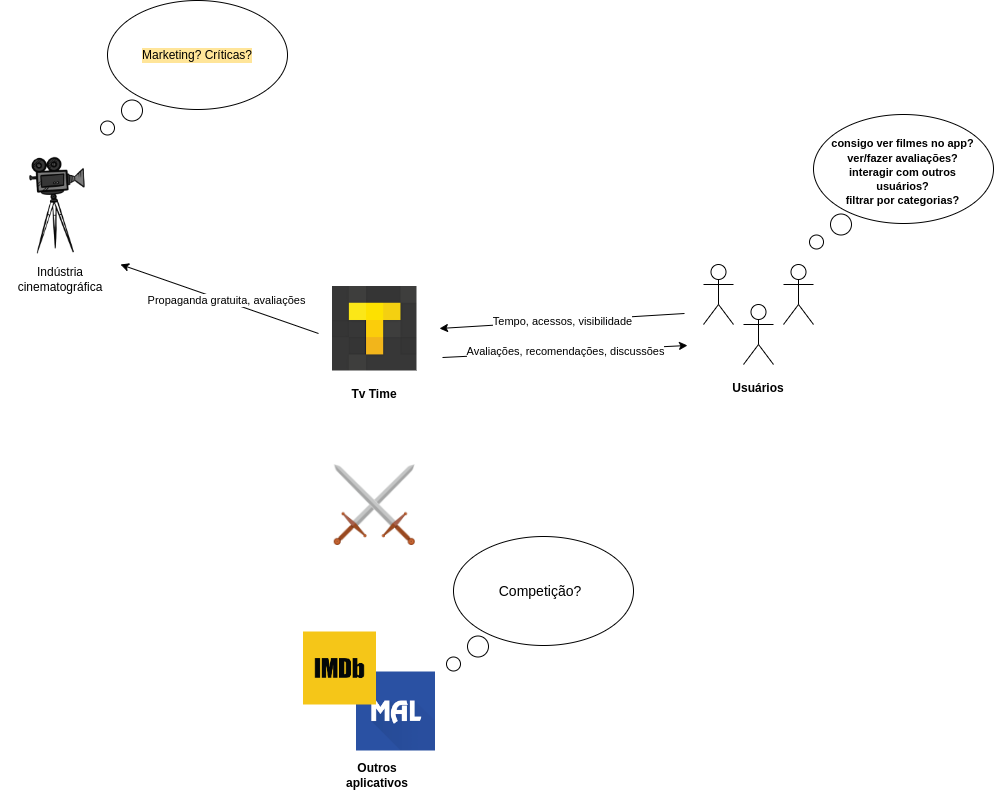
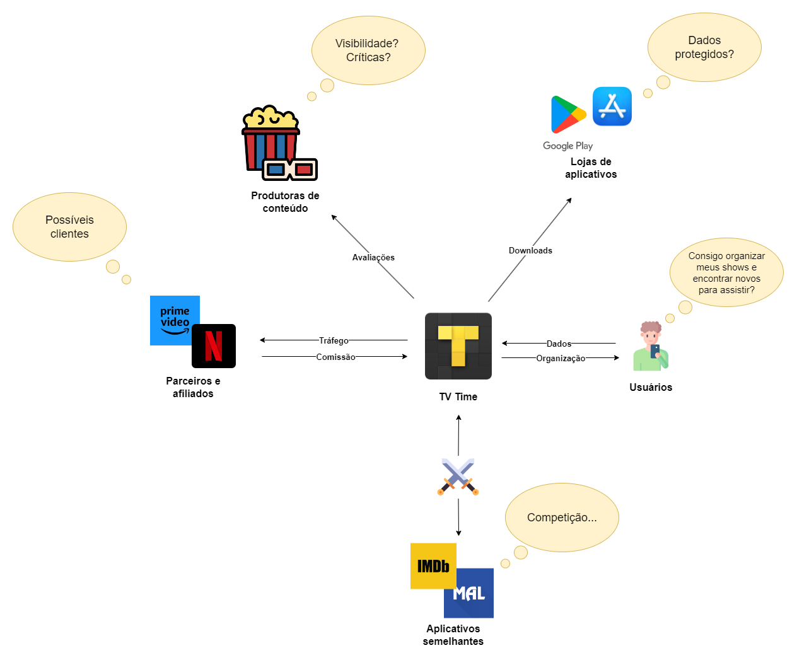
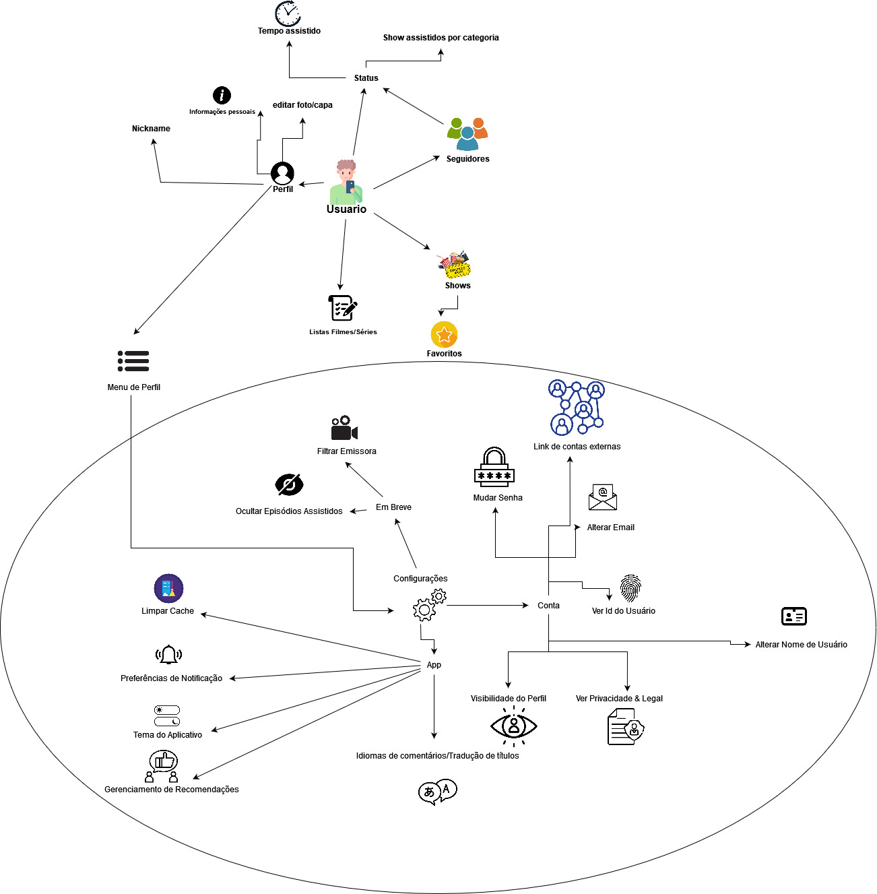

## Histórico de Revisão
---
| Data       | Autor         | Descrição                         | Versão  |
|------------|---------------|-----------------------------------|---------|
| 30-07-2024 |  Eric Rabelo, Wolfgang Friedrich  | Criação do documento e adição dos RichPictures Geral - Versão 1.0 e Geral - Versão 2.0 | 1.0     |
| 30-07-2024 |  Danilo Naves, Paulo Henrique Melo | Adicionando RichPicture - versão 1.0 de Usuários - | 1.1     |
| 31-07-2024 |  Paulo Henrique Melo | Adicionando RichPictures Shows - versão 1.0 e versão 2.0 | 1.2     |
| 21/08/2024 | Eric Rabelo Borges | Renomeando RichPictures: 'Geral' para 'Interessados no Sistema' e 'Usuário' para 'Perfil do Usuário'  | 1.2 |

## 1 - Introdução
---
RichPicture é um artefato usado para entender de forma visual o fluxo e a complexidade de uma situação. Geralmente usado na fase de pré-rastreabilidade para analisar problemas e expressar ideias. 

## 2 - Objetivo
---
A finalidade para o uso do RicPicture é fornecer um modelo que auxilia o entendimento e definição de uma situação ou escopo para trazer uma visão mais ampla do cenário que será analisado para o levantamento de requisitos.

## 3 - RichPicture
---

### 3.1 - Interessados no Sistema

#### Versão 1.0 {#v1geral}

> Autores: Eric, Paulo, Wolfgang, Sunamita. [Referência](../Atas/reuniao_23_07.md)

#### Versão 2.0 {#v2geral}

> Autores: Danilo, Eric, Paulo, Sunamita, Wolfgang. [Referência](../Atas/reuniao_25_07.md)

### 3.2 - Filmes/Séries 

#### Versão 1.0 {#v1shows}

> Autor: Paulo. [Referência](../documentacao/observacaoShows.md)

#### Versão 2.0 {#v2shows}

> Autores: Sunamita, Paulo. [Referência](../Atas/reuniao_29_07.md)

### 3.3 - Perfil do Usuário

#### Versão 1.0 {#v1usuario}

> Autores: Danilo, Paulo. [Referência](../Atas/reuniao_30_07.md)

#### Versão 2.0  {#v2usuario}

Gerado Rich Picture: Configurações de perfil de usuário

> Autores: Danilo, Wolfgang. [Referência](../Atas/reuniao_06_08.md)

